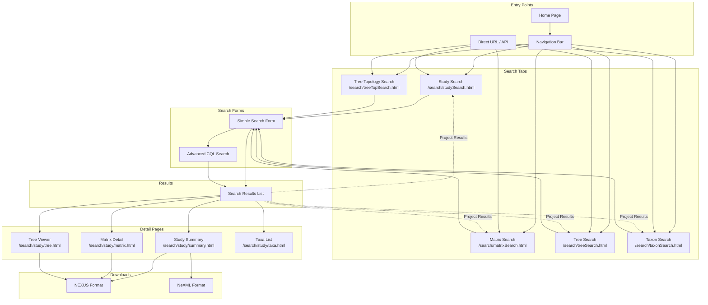

# User Story 01: Search

## Overview

**As a** user or automated agent,  
**I want to** search for study, tree, matrix, taxon or analysis data,  
**So that** I can find and access phylogenetic data relevant to my research or application.

## User Types

- Anonymous visitors (researchers, students, general public)
- Automated agents (harvesters, API clients, search engines)
- Registered users looking for data

## Current Pages

The following search pages are currently available in the TreeBASE web application:

- [x] **Study Search Page** (`/search/studySearch.html`) - Search for phylogenetic studies
- [x] **Matrix Search Page** (`/search/matrixSearch.html`) - Search for character matrices
- [x] **Tree Search Page** (`/search/treeSearch.html`) - Search for phylogenetic trees
- [x] **Taxon Search Page** (`/search/taxonSearch.html`) - Search for taxonomic names
- [x] **Tree Topology Search Page** (`/search/treeTopSearch.html`) - Search by tree structure

## Navigation Flow

The following diagram shows how users navigate through search pages:



### Navigation Notes

- Users can switch between search tabs at any time via the navigation bar
- When results exist, switching tabs projects the current result set to the new data type
- Each search page provides both simple and advanced (CQL) search options
- Search results include links to detail pages and download options

## Search Capabilities

## Searchable Data Types

TreeBASE supports searching across five primary data types. Each data type has specific searchable fields and display options.

### 1. Studies

Search for phylogenetic studies by metadata, authors, citations, etc.

**Searchable Fields:**
| Field | Description | CQL Predicate |
|-------|-------------|---------------|
| Study ID | TreeBASE study identifier (S####) | `tb.identifier.study` |
| Legacy Study ID | TreeBASE 1.x study identifier | `tb.identifier.study.tb1` |
| Author | Author name(s) | `dcterms.contributor` |
| Title | Study/publication title | `tb.title.study` |
| Abstract | Publication abstract | `dcterms.abstract` |
| Citation | Full bibliographic citation | `dcterms.bibliographicCitation` |
| Keywords | Subject keywords | `dcterms.subject` |
| DOI | Digital Object Identifier | `prism.doi` |

**Result Display Columns:**
- Study ID (with link to summary)
- Authors (first 3, then "et al.")
- Year
- Title
- Journal/Publisher
- DOI link (external)
- Download icons (NEXUS, NeXML)

### 2. Matrices

Search for character matrices used in phylogenetic analyses.

**Searchable Fields:**
| Field | Description | CQL Predicate |
|-------|-------------|---------------|
| Matrix ID | TreeBASE matrix identifier (M####) | `tb.identifier.matrix` |
| Title | Matrix title/name | `tb.title.matrix` |
| Type | Matrix data type | `tb.type.matrix` |
| NTAX | Number of taxa | `tb.ntax.matrix` |
| NCHAR | Number of characters | `tb.nchar.matrix` |

**Result Display Columns:**
- Matrix ID (with link to detail)
- Title
- Description
- Data Type
- NTAX
- NCHAR
- Download icons (original, reconstructed)
- View rows icon

### 3. Trees

Search for phylogenetic trees by properties, topology, or associated metadata.

**Searchable Fields:**
| Field | Description | CQL Predicate |
|-------|-------------|---------------|
| Tree ID | TreeBASE tree identifier (Tr####) | `tb.identifier.tree` |
| Title | Tree title/name | `tb.title.tree` |
| Type | Tree type (e.g., Species Tree) | `tb.type.tree` |
| Kind | Tree kind (e.g., Consensus) | `tb.kind.tree` |
| Quality | Tree quality assessment | `tb.quality.tree` |
| NTAX | Number of taxa | `tb.ntax.tree` |

**Result Display Columns:**
- Tree ID (with link to viewer)
- Label
- Title
- Tree Type
- Tree Kind
- Tree Quality
- NTAX
- View Taxa link
- Download icons (reconstructed, original)
- Tree viewer icon

### 4. Taxa

Search for taxonomic names and their occurrences across studies.

**Searchable Fields:**
| Field | Description | CQL Predicate |
|-------|-------------|---------------|
| Taxon ID | TreeBASE taxon identifier (Tx####) | `tb.identifier.taxon` |
| Legacy Taxon ID | TreeBASE 1.x taxon identifier | `tb.identifier.taxon.tb1` |
| NCBI ID | NCBI Taxonomy identifier | `tb.identifier.ncbi` |
| uBio ID | uBio Namebank identifier | `tb.identifier.ubio` |
| Taxon Name | Scientific name | `tb.title.taxon` |
| Taxon Label | Label as used in study | `tb.title.taxonLabel` |
| Taxon Variant | Name variant | `tb.title.taxonVariant` |

**Result Display Columns:**
- Taxon ID
- Taxon Name
- uBio ID (with external link)
- NCBI ID (with external link)

### 5. Tree Topologies

Search for trees based on their structural topology patterns.

> **Note:** Tree Topology searches use a form-based interface rather than CQL queries. Users specify taxon names 
> in a visual tree structure diagram, and the system finds trees matching that relationship pattern.

**Search Types:**
| Search Type | Description | Input Fields |
|-------------|-------------|--------------|
| 3-Taxon Topology | Find trees containing a specific 3-taxon relationship | taxon_a, taxon_b, taxon_c |
| 4-Taxon Asymmetric | Find trees with asymmetric 4-taxon topology | taxon_a, taxon_b, taxon_c, taxon_d |
| 4-Taxon Symmetric | Find trees with symmetric 4-taxon topology | taxon_a, taxon_b, taxon_c, taxon_d |

**Result Display:** Same as Trees (returns matching tree records)

### 6. Classification Search (Secondary)

The Classification Search (`/search/classificationSearch.html`) provides an alternative way to browse taxonomic 
hierarchies. This is a specialized search interface that is not part of the main search tab navigation.

**Note:** This feature is accessible via direct URL but is not prominently featured in the main search navigation.

### Tab Navigation

Each search type is accessible via a dedicated tab in the search interface. When a user selects a tab:

- The search form updates to show relevant search fields for that data type
- An advanced search option is available for more complex queries using CQL
- The results page displays items of the selected type
- Pagination and sorting options are specific to the selected data type

## Result Set Projection

Users can project (transform) a result set from one data type into another. This allows users to explore related data 
across different dimensions.

### How Result Projection Works

After performing a search and obtaining a result set, users can switch to a different data type tab to see the related 
items. The system computes the union of all items of the new type that are associated with the original result set.

### Example: Studies → Taxa

1. **Initial Search**: User performs a study search and obtains a list of matching studies
2. **Projection**: User switches to the "Taxa" tab
3. **Result**: The system displays the union of all taxa that appear in any of the studies from the original result set

### Supported Projections

| From | To | Description |
|------|-----|-------------|
| Studies | Taxa | All taxa referenced in the selected studies |
| Studies | Matrices | All matrices associated with the selected studies |
| Studies | Trees | All trees generated by the selected studies |
| Studies | Tree Topologies | All tree topologies found in the selected studies |
| Matrices | Taxa | All taxa included in the selected matrices |
| Matrices | Studies | All studies that contain the selected matrices |
| Matrices | Trees | All trees derived from the selected matrices |
| Matrices | Tree Topologies | All tree topologies derived from the selected matrices |
| Trees | Taxa | All taxa present in the selected trees |
| Trees | Studies | All studies that produced the selected trees |
| Trees | Matrices | All matrices used to generate the selected trees |
| Trees | Tree Topologies | Topology patterns of the selected trees |
| Taxa | Studies | All studies that reference the selected taxa |
| Taxa | Matrices | All matrices containing the selected taxa |
| Taxa | Trees | All trees that include the selected taxa |
| Taxa | Tree Topologies | All tree topologies that include the selected taxa |
| Tree Topologies | Trees | All trees matching the selected topologies |
| Tree Topologies | Studies | All studies containing trees with the selected topologies |
| Tree Topologies | Matrices | All matrices that produced trees matching the selected topologies |
| Tree Topologies | Taxa | All taxa present in trees matching the selected topologies |

### Use Cases

- **Taxonomic Analysis**: Start with a study search, then project to taxa to understand which organisms are covered
- **Data Discovery**: Search for taxa, then project to studies to find relevant research
- **Tree Comparison**: Search for tree topologies, then project to studies to compare methodologies
- **Cross-Study Analysis**: Search for specific matrices, then project to taxa to see overlapping organisms

## User Interface

### Search Tabs

```
┌─────────┬──────────┬────────┬────────┬─────────────────┐
│ Studies │ Matrices │ Trees  │ Taxa   │ Tree Topologies │
└─────────┴──────────┴────────┴────────┴─────────────────┘
```

Each tab is clickable and:
- Projects the current result set into the selected type when results from a previous search exist
- Performs a new search of that type when starting fresh (no previous results)

A "Clear Results" option allows users to start a new search without projection.

### Result Projection Indicator

When viewing projected results, the interface should indicate:
- The original search type and query
- The current projection type
- The total number of items in both the original and projected result sets

## Technical Notes

- Result projection is computed dynamically based on database relationships
- Large result sets (over 1,000 items) may trigger a warning to users about potential delay when projecting
- Pagination applies to displayed results; projection computes against the complete result set
- Cache strategies may be employed to improve projection performance for frequently accessed result sets
- Maximum result set size for projection is configurable by administrators

## Pages to Account For

Complete inventory of pages related to search functionality:

### Main Search Pages

| Page | URL Pattern | Description | Status |
|------|-------------|-------------|--------|
| Study Search | `/search/studySearch.html` | Main study search interface | Active |
| Matrix Search | `/search/matrixSearch.html` | Matrix search interface | Active |
| Tree Search | `/search/treeSearch.html` | Tree search interface | Active |
| Taxon Search | `/search/taxonSearch.html` | Taxon search interface | Active |
| Tree Topology Search | `/search/treeTopSearch.html` | Topology-based tree search | Active |

### Secondary Search Pages

| Page | URL Pattern | Description | Status |
|------|-------------|-------------|--------|
| Classification Search | `/search/classificationSearch.html` | Hierarchical classification browse (not in main nav) | Active |

### Study Detail Pages

| Page | URL Pattern | Description | Status |
|------|-------------|-------------|--------|
| Study Summary | `/search/study/summary.html` | Study detail/summary view | Active |
| Study Matrices | `/search/study/matrices.html` | Matrices within a study | Active |
| Study Trees | `/search/study/trees.html` | Trees within a study | Active |
| Study Taxa | `/search/study/taxa.html` | Taxa within a study | Active |
| Study Analyses | `/search/study/analyses.html` | Analyses within a study | Active |
| Study Analysis Detail | `/search/study/analysis.html` | Single analysis detail | Active |
| Matrix Detail | `/search/study/matrix.html` | Matrix detail view | Active |
| Tree Viewer | `/search/study/tree.html` | Interactive tree viewer | Active |
| Tree Block Viewer | `/search/study/treeBlock.html` | Tree block viewer | Active |
| Tree Blocks List | `/search/study/treeBlocks.html` | List of tree blocks | Active |
| Row Segments | `/search/study/rowSegments.html` | Matrix row segments | Active |

### Download Endpoints

| Page | URL Pattern | Description | Status |
|------|-------------|-------------|--------|
| Row Segments TSV | `/search/study/rowSegmentsTSV.html` | Row segments as TSV download | Active |
| RDF Export | `/search/study/anyObjectAsRDF.rdf` | RDF export for any object | Active |
| Download Study | `/search/downloadAStudy.html` | Download complete study | Active |
| Download Tree | `/search/downloadATree.html` | Download single tree | Active |
| Download Tree Block | `/search/downloadATreeBlock.html` | Download tree block | Active |
| Download Matrix | `/search/downloadAMatrix.html` | Download single matrix | Active |
| Download Analysis Step | `/search/downloadAnAnalysisStep.html` | Download analysis step data | Active |
| Download NEXUS | `/search/downloadANexusFile.html` | Download original NEXUS file | Active |
| Download NEXUS RCT | `/search/downloadANexusRCTFile.html` | Download reconstructed NEXUS file | Active |

### PhyloWS API Endpoints

| Endpoint | Description |
|----------|-------------|
| `/phylows/study/find` | Study search API |
| `/phylows/matrix/find` | Matrix search API |
| `/phylows/tree/find` | Tree search API |
| `/phylows/taxon/find` | Taxon search API |

## Wireframe Notes

*To be completed in future PR*

## Open Questions

- What search refinement options should be available?
- How should results be sorted and paginated?
- What metadata should be shown in search results?