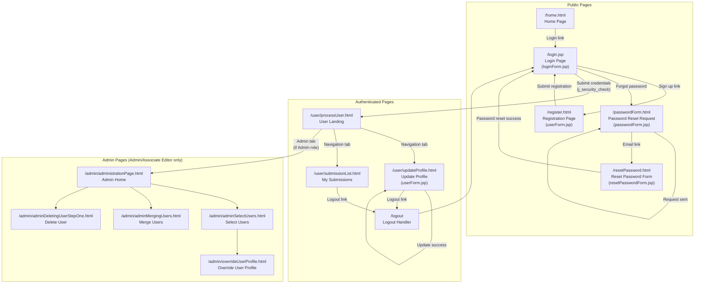

# User Story 2: Account Management

## Overview

**As a** user,  
**I want to** create or update my user account and log in,  
**So that** I can access authenticated features like data submission and study management.

## User Types

- New users creating an account
- Existing users logging in
- Users updating their profile information
- Users managing their password/credentials

## Current Pages

The following pages apply to this user story:

- [x] Registration page (`/register.html` → `userForm.jsp`)
- [x] Login page (`/login.jsp` → `loginForm.jsp`)
- [x] Logout functionality (`/logout.jsp` → Spring Security logout handler `/logout`)
- [x] User profile page (`/user/updateProfile.html` → `userForm.jsp`)
- [x] Password reset request page (`/passwordForm.html` → `passwordForm.jsp`)
- [x] Password reset form page (`/resetPassword.html` → `resetPasswordForm.jsp`)
- [x] Admin user management pages (`/admin/overrideUserProfile.html`, `/admin/adminSelectUsers.html`, etc.)

## Navigation Flow

The following diagram documents how users navigate through account management pages:

## Account Features

### Registration

Registration is handled by `RegisterUserController` with the following requirements from the current implementation:

**Required Fields:**
- **Username** - Unique identifier for login (required, unique in database)
- **Password** - User's password (required, minimum validation via JavaScript)
- **Re-typed Password** - Password confirmation (required, must match password)
- **First Name** - User's first name (required)
- **Last Name** - User's last name (required)
- **Email Address** - Contact email (required, unique in database)

**Optional Fields:**
- **Middle Name** - User's middle name
- **Phone Number** - Contact phone number

**Registration Flow:**
1. User navigates to `/register.html`
2. User fills in required and optional fields
3. Client-side JavaScript validates password match via `checkPasswords()`
4. Server-side validation via `BeanValidator` checks field constraints
5. Password is encoded using BCrypt via `PasswordEncoder`
6. `UserService.createUser()` checks for duplicate username/email
7. On success, redirect to `/login.jsp`
8. On failure (duplicate username/email), error message displayed

### Authentication

Authentication is implemented using Spring Security 5.8.15 with the following details:

**Login Mechanism:**
- Form-based authentication at `/j_security_check`
- Username parameter: `j_username`
- Password parameter: `j_password`
- Login page: `/login.jsp`
- Default success URL: `/user/processUser.html`
- Failure URL: `/login.jsp?error=true`

**Password Handling:**
- `DelegatingPasswordEncoder` for backward compatibility (supports BCrypt and legacy plain text)
- `PasswordUpgradeAuthenticationSuccessHandler` automatically upgrades plain text passwords to BCrypt on successful login

**Session Management:**
- Session fixation protection: `newSession` strategy
- CSRF protection: Currently disabled for backward compatibility

**Authorization (URL-based):**
- `/submit.html` - Requires: User, Admin, or Associate Editor
- `/user/**` - Requires: User, Admin, or Associate Editor
- `/admin/**` - Requires: Admin or Associate Editor

**Role Configuration:**
- Role prefix: Empty string (no `ROLE_` prefix)
- Existing roles in database: `Admin`, `User`, `Associate Editor`

**Logout:**
- Logout URL: `/logout`
- Logout success URL: `/login.jsp`
- Session invalidation handled by Spring Security

### Profile Management

Profile management is handled by `UserFormController` with the following functionality:

**View/Update Profile:**
- URL: `/user/updateProfile.html`
- Controller: `UserFormController`
- View: `userForm.jsp`

**Editable Fields:**
- **Password** - Can update password (leave blank to keep current)
- **Re-typed Password** - Must match new password if changing
- **First Name** - User's first name
- **Middle Name** - User's middle name (optional)
- **Last Name** - User's last name
- **Phone Number** - Contact phone number (optional)
- **Email Address** - Contact email

**Read-only Fields:**
- **Username** - Cannot be changed after registration

**Security:**
- Users can only modify their own profile
- Admin users can modify other users' profiles via `/admin/overrideUserProfile.html`
- Password changes are validated and BCrypt-encoded before storage

**View Submission History:**
- URL: `/user/submissionList.html`
- Shows list of user's submissions with their status
- Each submission links to detailed view and editing options

**Notification Preferences:**
- Not currently implemented in the system
- Future enhancement opportunity

## Pages to Account For

The following is a complete inventory of pages related to account management based on `/treebase-web/src/main/webapp/WEB-INF/treebase-servlet.xml`:

| Page | URL Pattern | Controller | View | Status |
|------|-------------|------------|------|--------|
| Registration | `/register.html` | `registerUserController` | `userForm.jsp` | Active |
| Login | `/login.jsp` (static) | - | `login.jsp` | Active |
| Login Form | `/login.jsp` | - | `loginForm.jsp` (included) | Active |
| Password Reset Request | `/passwordForm.html` | `passwordFormController` | `passwordForm.jsp` | Active |
| Password Reset Form | `/resetPassword.html` | `resetPasswordController` | `resetPasswordForm.jsp` | Active |
| User Profile | `/user/updateProfile.html` | `userFormController` | `userForm.jsp` | Active |
| Process User (Post-login) | `/user/processUser.html` | `processUserController` | - | Active |
| Submission List | `/user/submissionList.html` | `listSubmissionController` | `submissionList.jsp` | Active |
| Admin - Select Users | `/admin/adminSelectUsers.html` | `adminSelectUsersController` | `adminSelectUsers.jsp` | Active |
| Admin - User List | `/admin/userList.html` | `filenameController` | `userList.jsp` | Active |
| Admin - Override Profile | `/admin/overrideUserProfile.html` | `adminOverridingUserFormController` | `overrideUserProfile.jsp` | Active |
| Admin - Update User Info | `/admin/adminUpdatingUserInfo.html` | `adminUpdatingUserInfoController` | `adminUpdatingUserInfo.jsp` | Active |
| Admin - Delete User Step 1 | `/admin/adminDeletingUserStepOne.html` | `adminDeletingUserStepOneController` | `adminDeletingUserStepOne.jsp` | Active |
| Admin - Delete User Step 2 | `/admin/adminDeletingUserStepTwo.html` | `adminDeletingUserStepTwoController` | `adminDeletingUserStepTwo.jsp` | Active |
| Admin - Merge Users | `/admin/adminMergingUsers.html` | `adminMergingUsersController` | `adminMergingUsers.jsp` | Active |
| Admin - User Management | `/admin/userManagement.html` | `userManagementController` | `simpleUserManagement.jsp` | Active |
| Logout | `/logout` | Spring Security | Redirect to `/login.jsp` | Active |

## Security Considerations

- **Password strength requirements**: Minimum 8 characters enforced in password reset form; registration form uses JavaScript validation but should be enhanced
- **Account lockout policies**: Not currently implemented; consider adding after N failed attempts
- **Session timeout**: Managed by servlet container (Tomcat) defaults
- **HTTPS requirements**: Should be enforced at server/proxy level; not enforced in application code
- **Email verification**: Not currently implemented; email is validated but not verified via confirmation link
- **Password reset token security**:
  - Tokens are cryptographically secure (UUID-based)
  - 24-hour expiration
  - Single-use (marked as used after successful reset)
  - Previous tokens invalidated when new one is generated
  - Timing-attack protection via normalized response times
- **CSRF protection**: Currently disabled; should be enabled in future security hardening
- **Role-based access control**: Implemented via Spring Security with URL-based authorization

## Wireframe Notes

*To be completed in future PR*

---

## Related Files

### Controllers
- `RegisterUserController.java` - New user registration
- `UserFormController.java` - Profile updates
- `PasswordFormController.java` - Password reset request
- `ResetPasswordController.java` - Password reset form handling
- `ProcessUserController.java` - Post-login processing
- `AbstractUserController.java` - Base controller for user operations
- `AdminOverridingUserFormController.java` - Admin profile editing
- `AdminDeletingUserStepOneController.java` / `StepTwoController.java` - User deletion
- `AdminMergingUsersController.java` - User account merging
- `AdminSelectUsersController.java` - Admin user selection

### Domain Objects
- `User.java` - User entity implementing `UserDetails`
- `UserRole.java` - Role entity (Admin, User, Associate Editor)
- `PasswordResetToken.java` - Secure password reset tokens
- `Person.java` - Personal information linked to User

### Services
- `UserService.java` - User business logic
- `PasswordResetTokenHome.java` - Token persistence

### Security
- `treebase-security.xml` - Spring Security configuration
- `DelegatingPasswordEncoder.java` - BCrypt + legacy support
- `PasswordUpgradeAuthenticationSuccessHandler.java` - Auto password upgrade

### Views (JSP)
- `userForm.jsp` - Registration and profile editing
- `login.jsp` - Login page container
- `loginForm.jsp` - Login form widget
- `passwordForm.jsp` - Password reset request
- `resetPasswordForm.jsp` - New password entry
- `overrideUserProfile.jsp` - Admin profile editing
- `userList.jsp` - Admin user list

### Common Components
- `nav.jsp` - Navigation tabs (Personal Info, Submissions, Search, Admin)
- `header.jsp` - Site header
- `defaultTemplate.jsp` - Main template with login status display
