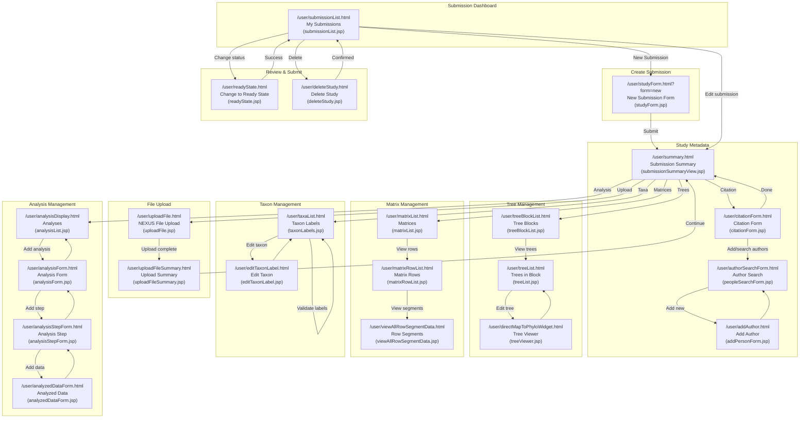

# User Story 3: Data Submission

## Overview

**As a** registered user,  
**I want to** submit study, tree, matrix, taxon or analysis data,  
**So that** I can share my phylogenetic research with the scientific community.

## User Types

- Researchers submitting their own studies
- Students submitting work on behalf of advisors
- Data curators submitting historical data

## Prerequisites

- User must be logged in (see [User Story 2: Account Management](user-story-02-account.md))

## Current Pages

The following pages apply to this user story:

- [x] Submission dashboard (`/user/submissionList.html` → `submissionList.jsp`)
- [x] New submission form (`/user/studyForm.html?form=new` → `studyForm.jsp`)
- [x] Study summary/metadata (`/user/summary.html` → `submissionSummaryView.jsp`)
- [x] Citation form (`/user/citationForm.html` → `citationForm.jsp`)
- [x] Author search/add (`/user/authorSearchForm.html`, `/user/addAuthor.html` → `peopleSearchForm.jsp`, `addPersonForm.jsp`)
- [x] File upload interface (`/user/uploadFile.html` → `uploadFile.jsp`)
- [x] Upload summary (`/user/uploadFileSummary.html` → `uploadFileSummary.jsp`)
- [x] Tree blocks list (`/user/treeBlockList.html` → `treeBlockList.jsp`)
- [x] Tree list/editor (`/user/treeList.html` → `treeList.jsp`)
- [x] Tree viewer/editor (`/user/directMapToPhyloWidget.html` → `treeViewer.jsp`)
- [x] Matrix list/editor (`/user/matrixList.html` → `matrixList.jsp`)
- [x] Matrix row list (`/user/matrixRowList.html` → `matrixRowList.jsp`)
- [x] Row segment data (`/user/viewAllRowSegmentData.html` → `viewAllRowSegmentData.jsp`)
- [x] Taxa management (`/user/taxaList.html` → `taxonLabels.jsp`)
- [x] Edit taxon label (`/user/editTaxonLabel.html` → `editTaxonLabel.jsp`)
- [x] Analysis display (`/user/analysisDisplay.html` → `analysisList.jsp`)
- [x] Analysis form (`/user/analysisForm.html` → `analysisForm.jsp`)
- [x] Analysis step form (`/user/analysisStepForm.html` → `analysisStepForm.jsp`)
- [x] Analyzed data form (`/user/analyzedDataForm.html` → `analyzedDataForm.jsp`)
- [x] Ready state confirmation (`/user/readyState.html` → `readyState.jsp`)
- [x] Delete study (`/user/deleteStudy.html` → `deleteStudy.jsp`)
- [x] Submission tutorial (`/submitTutorial.html` → `submitTutorial.jsp`)

## Navigation Flow

The following diagram documents how users navigate through the submission pages:

## Submission Workflow

### Step 1: Study Information

Study information is recorded on multiple pages managed by `StudyFormController` and `CitationFormController`:

**Study Form** (`/user/studyForm.html` → `studyForm.jsp`):
- **Study Name** (required) - Brief title, usually same as publication title
- **Study Notes** - Private notes for submitter/staff communication, not public

**Citation Form** (`/user/citationForm.html` → `citationForm.jsp`):
- **Citation Type** (required) - Article, Book, or Book Section
- **Publish Year** (required) - Year of publication (1900 to current+1)
- **Publication Status** - Status of the publication

For Article citations (`citationForm-article.jsp`):
- **Article Title** (required)
- **Keywords** - Comma-separated keywords
- **Abstract** - Publication abstract
- **PubMed ID** (PMID) - Maximum 10 characters
- **DOI** - Digital Object Identifier
- **URL** - Link to publication
- **Journal** (required) - Autocomplete from existing journals
- **Volume**
- **Issue**
- **Pages** - In format like "11-28"

**Author Management** (`/user/authorSearchForm.html`, `/user/addAuthor.html`):
- Search for existing authors or add new ones
- Authors linked to citation via `AuthorFormController`

### Step 2: Data Upload

File upload is handled by `UploadFileController` (`/user/uploadFile.html` → `uploadFile.jsp`):

**Supported Formats:**
- **NEXUS** - Primary format, parsed by Mesquite
- Files must be parseable by Mesquite before upload

**Upload Interface:**
- Multiple file upload support via "Attach another file"
- Progress bar during upload
- **Maximum upload size**: 250MB (configured in `treebase-servlet.xml`)

**Upload Constraints:**
- Only first ~30 trees are parsed to avoid overwhelming the interface
- Users should place preferred/consensus trees first in the tree block

**Upload Summary** (`/user/uploadFileSummary.html` → `uploadFileSummary.jsp`):
- Shows count of matrices uploaded
- Shows count of trees uploaded
- Parser log available via "Show Parser Log" button

### Step 3: Tree Data

Tree management is handled by `ListTreeBlockController` and `ListTreeController`:

**Tree Block List** (`/user/treeBlockList.html` → `treeBlockList.jsp`):
- **Block Title** - Editable title for the tree block
- **Tree Count** - Number of trees in the block
- **Analysis Status** - Icon showing if block is linked to an analysis
- Actions: View trees, View in PhyloWidget, Download, Delete

**Tree List** (`/user/treeList.html` → `treeList.jsp`):
- **Tree Label** - Editable label
- **Tree Title** - Editable title
- **Tree Type** - Dropdown selection (e.g., Consensus, Single)
- **Tree Kind** - Dropdown selection (e.g., Species Tree, Gene Tree)
- **Tree Quality** - Dropdown selection
- **Analysis Status** - Icon showing if tree is linked to an analysis
- Actions: Edit in PhyloWidget, Download reconstructed, Download original NEXUS, Delete

**Tree Viewer** (`/user/directMapToPhyloWidget.html` → `treeViewer.jsp`):
- PhyloWidget-based tree visualization and editing
- Opens in popup window (1000x900 pixels)

### Step 4: Matrix Data

Matrix management is handled by `ListMatrixController`:

**Matrix List** (`/user/matrixList.html` → `matrixList.jsp`):
- **Matrix Title** - Editable title
- **Matrix Description** - Editable description
- **Matrix Kind** - Dropdown selection (e.g., DNA, Protein, Morphological)
- **Analysis Status** - Icon showing if matrix is linked to an analysis
- Actions: View rows, Download reconstructed, Download original NEXUS, Delete

**Matrix Row List** (`/user/matrixRowList.html` → `matrixRowList.jsp`):
- View matrix rows
- Navigate to row segments

**Row Segment Data** (`/user/viewAllRowSegmentData.html` → `viewAllRowSegmentData.jsp`):
- View detailed character state data
- Export functionality available

### Step 5: Taxonomic Data

Taxon management is handled by `ListTaxaController` and `EditTaxonLabelController`:

**Taxon Labels List** (`/user/taxaList.html` → `taxonLabels.jsp`):
- **Taxon Label** - Original label from data file
- **Taxon Name** - Mapped scientific name
- **NCBI Tax ID** - Link to NCBI Taxonomy Browser
- **uBio Tax ID** - Link to uBio NameBank
- **Validation Status** - Icon showing if linking was attempted
- Actions: Edit, Bulk update, Validate selected labels

**Edit Taxon Label** (`/user/editTaxonLabel.html` → `editTaxonLabel.jsp`):
- **Taxon Label** - Editable text, guidelines provided for formatting
- **External Taxonomy** - Radio selection from suggested matches:
  - NCBI taxonomy suggestions with IDs
  - uBio lookup option with manual NamebankID entry
  - "No association" option if no match exists

**Validation Process:**
- Labels validated against uBio and NCBI taxonomies
- Guidelines: Use full binomials (no abbreviations), separate codes with spaces
- "Validate Taxon Labels" button triggers bulk validation

### Step 6: Analysis Information

Analysis management is handled by `AnalysisFormController` and `AnalysisStepFormController`:

**Analysis Form** (`/user/analysisForm.html` → `analysisForm.jsp`):
- **Analysis Name** - Descriptive name for the analysis
- **Analysis Notes** - Additional notes about the analysis

**Analysis Step Form** (`/user/analysisStepForm.html` → `analysisStepForm.jsp`):
- **Step Name** - Name for this analysis step
- **Step Notes** - Additional notes
- **Commands** - Actual commands/settings used
- **Software Name** - Autocomplete from known software
- **Software Version** - Version number
- **Software URL** - Link to software
- **Software Description** - Brief description
- **Algorithm Type** - Dropdown: Maximum Likelihood, Parsimony, Distance, Bayesian, Other
- **New Algorithm** - Text field when "Other Algorithm" selected

**Analyzed Data** (`/user/analyzedDataForm.html` → `analyzedDataForm.jsp`):
- Multi-page wizard for linking inputs/outputs:
  1. Select data type and input/output designation
  2. Select matrices (for input)
  3. Select trees (for output)
  4. Select tree blocks

### Step 7: Review and Submit

The review and submission process validates data completeness before allowing status change:

**Submission Summary** (`/user/summary.html` → `submissionSummaryView.jsp`):
- Displays submission number and status
- Shows study accession URL (permanent identifier)
- Shows reviewer access URL with access code
- Citation summary if entered
- Abstract if provided
- Analysis list embedded

**Ready State Confirmation** (`/user/readyState.html` → `readyState.jsp`):

**Pre-submission Validation Checks:**
The following must be satisfied before changing to "Ready State":
1. Citation entered with minimum: authors, year, title, journal name
2. No orphaned matrices (all matrices must be inputs to at least one analysis)
3. No orphaned trees (all trees must be outputs from at least one analysis)
4. Tree taxon labels must match input matrix taxon labels
5. Taxon labels validation attempted (via "Validate Taxon Labels" button)

**Submission Confirmation:**
- Warning message about read-only status after submission
- Exception: Citation metadata can still be updated (volume, issue, pages, DOI)
- Submit button completes the status change

## Data Validation

Data validation occurs at multiple stages in the submission process:

### File Format Validation

**At Upload Time:**
- NEXUS files are parsed using Mesquite library
- Invalid syntax results in parse errors shown in Parser Log
- Recommendation: Test files in Mesquite before upload

**File Size Validation:**
- Maximum upload size: 250MB (configurable in `treebase-servlet.xml`)
- Tree block limit: Only first ~30 trees parsed per block

### Required Field Validation

**Study Form:**
- Study Name: Required, validated server-side

**Citation Form:**
- Citation Type: Required (Article, Book, Book Section)
- Publish Year: Required, validated 1900 ≤ year ≤ current+1
- Title: Required for articles
- Journal: Required for articles
- At least one author required (validated at Ready State)

**Analysis Step Form:**
- Algorithm Type validation when "Other" selected - New Algorithm field required

### Taxonomic Name Validation

**Automated Validation:**
- Triggered by "Validate Taxon Labels" button
- Matches labels against uBio and NCBI taxonomies
- Visual indicators show validation status:
  - Green checkmark: Linking attempted
  - Red X: Not yet validated

**Manual Validation:**
- Edit individual labels via Edit Taxon Label page
- Search uBio manually and enter NamebankID
- Select "no association" for unmatched taxa

### Consistency Checks (at Ready State)

The system validates the following before allowing status change:

1. **Citation Completeness:**
   - Authors present
   - Year present
   - Title present
   - Journal name present (for articles)

2. **Data Completeness:**
   - No orphaned matrices (each matrix linked to ≥1 analysis as input)
   - No orphaned trees (each tree linked to ≥1 analysis as output)

3. **Taxon Label Matching:**
   - Output tree taxon labels must exist in input matrix
   - Mismatched labels prevent Ready State

4. **Validation Attempted:**
   - Taxon label validation must be attempted

**Error Display:**
- Errors shown in red at top of Ready State page
- Tool Box items highlighted in yellow indicate problems
- Hover over highlighted items for error details

## Pages to Account For

Complete inventory of pages related to data submission from `/treebase-web/src/main/webapp/WEB-INF/treebase-servlet.xml`:

| Page | URL Pattern | Controller | View | Status |
|------|-------------|------------|------|--------|
| Submission List | `/user/submissionList.html` | `listSubmissionController` | `submissionList.jsp` | Active |
| New Study Form | `/user/studyForm.html` | `studyFormController` | `studyForm.jsp` | Active |
| Submission Summary | `/user/summary.html` | `summaryController` | `submissionSummaryView.jsp` | Active |
| Citation Form | `/user/citationForm.html` | `citationFormController` | `citationForm.jsp` | Active |
| Author Search | `/user/authorSearchForm.html` | `authorSearchFormController` | `peopleSearchForm.jsp` | Active |
| Add Author | `/user/addAuthor.html` | `addAuthorController` | `addPersonForm.jsp` | Active |
| Upload File | `/user/uploadFile.html` | `uploadFileController` | `uploadFile.jsp` | Active |
| Upload Summary | `/user/uploadFileSummary.html` | `uploadFileSummaryController` | `uploadFileSummary.jsp` | Active |
| Tree Block List | `/user/treeBlockList.html` | `listTreeBlockController` | `treeBlockList.jsp` | Active |
| Tree List | `/user/treeList.html` | `listTreeController` | `treeList.jsp` | Active |
| Tree Viewer | `/user/directMapToPhyloWidget.html` | `directMapToPhyloWidgetController` | `treeViewer.jsp` | Active |
| Delete Tree | `/user/deleteATree.html` | `deleteATreeController` | `generalDeletePage.jsp` | Active |
| Delete Tree Block | `/user/deleteATreeBlock.html` | `deleteATreeBlockController` | `generalDeletePage.jsp` | Active |
| Matrix List | `/user/matrixList.html` | `listMatrixController` | `matrixList.jsp` | Active |
| Matrix Row List | `/user/matrixRowList.html` | `listMatrixRowController` | `matrixRowList.jsp` | Active |
| Row Segment List | `/user/matrixRowSegmentList.html` | `listMatrixRowSegmentController` | `matrixRowSegmentList.jsp` | Active |
| View All Row Segments | `/user/viewAllRowSegmentData.html` | `viewAllRowSegmentDataController` | `viewAllRowSegmentData.jsp` | Active |
| Delete Matrix | `/user/deleteAMatrix.html` | `deleteAMatrixController` | `generalDeletePage.jsp` | Active |
| Taxa List | `/user/taxaList.html` | `listTaxaController` | `taxonLabels.jsp` | Active |
| Edit Taxon Label | `/user/editTaxonLabel.html` | `editTaxonLabelController` | `editTaxonLabel.jsp` | Active |
| Edit Set Taxon Labels | `/user/editSetTaxonLabel.html` | `editSetTaxonLabelController` | `editSetTaxonLabel.jsp` | Active |
| Analysis List | `/user/analysisList.html` | `listAnalysisController` | `analysisList.jsp` | Active |
| Analysis Display | `/user/analysisDisplay.html` | `displayAnalysisController` | `analysisList.jsp` | Active |
| Analysis Form | `/user/analysisForm.html` | `analysisFormController` | `analysisForm.jsp` | Active |
| Analysis Step List | `/user/analysisStepList.html` | `listAnalysisStepController` | `analysisStepList.jsp` | Active |
| Analysis Step Form | `/user/analysisStepForm.html` | `analysisStepFormController` | `analysisStepForm.jsp` | Active |
| Analyzed Data List | `/user/analyzedDataList.html` | `listAnalyzedDataController` | `analyzedDataList.jsp` | Active |
| Analyzed Data Form | `/user/analyzedDataForm.html` | `analyzedDataFormController` | `analyzedDataForm.jsp` | Active |
| Add Analyzed Data | `/user/addAnalyzedData.html` | `addAnalyzedDataController` | - | Active |
| Ready State | `/user/readyState.html` | `readyStateController` | `readyState.jsp` | Active |
| Delete Study | `/user/deleteStudy.html` | `deleteStudyController` | `deleteStudy.jsp` | Active |
| Submit Tutorial | `/submitTutorial.html` | `filenameController` | `submitTutorial.jsp` | Active |
| Download Tree | `/user/downloadATree.html` | `downloadATreeController` | - | Active |
| Download Tree Block | `/user/downloadATreeBlock.html` | `downloadATreeBlockController` | - | Active |
| Download Matrix | `/user/downloadAMatrix.html` | `downloadAMatrixController` | - | Active |
| Download NEXUS File | `/user/downloadANexusFile.html` | `downloadANexusFileController` | - | Active |

## Wireframe Notes

*To be completed in future PR*

## Open Questions

The following questions have been addressed based on current implementation:

- **What file formats should be supported?**
  - NEXUS is the primary supported format
  - Files must be parseable by Mesquite
  - TreeBASE does not directly support Newick-only files; they should be embedded in NEXUS format

- **What is the maximum file size?**
  - 250MB maximum upload size (configured in `treebase-servlet.xml`)
  - Only first ~30 trees per block are parsed

- **Can submissions be saved as drafts?**
  - Yes, submissions in "In Progress" status function as drafts
  - Users can continue editing until they change status to "Ready"
  - "In Progress" submissions are not visible to the public

- **What validation happens at each step vs. at submission?**
  - File validation: At upload time (NEXUS parsing)
  - Field validation: On form submission (server-side Spring validators)
  - Comprehensive validation: When changing to "Ready State" (orphan checks, taxon matching, etc.)

## Security Considerations

- **File Upload Security**: File uploads handled by `AjaxMultipartResolver` with size limits
- **Access Control**: Submission pages require User, Admin, or Associate Editor role
- **Study Ownership**: Users can only modify their own submissions (enforced in controllers)
- **Status Transitions**: Only study owners and admins can change submission status
- **Read-only After Ready**: Once in "Ready" status, only citation metadata can be updated
