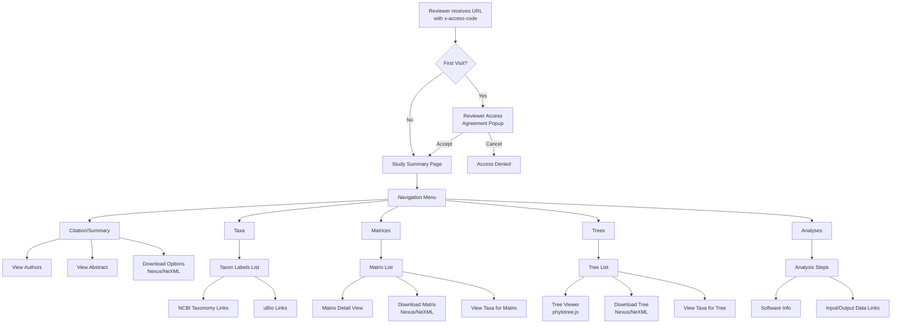

# User Story 4: Review

## Overview

**As a** reviewer,  
**I want to** review a study with tree, matrix, taxon and analysis data,  
**So that** I can verify the quality and accuracy of submitted phylogenetic data.

## User Types

- Journal editors reviewing submissions
- Peer reviewers assigned to studies
- TreeBASE curators performing quality control

## Prerequisites

- Data submitter has provided the reviewer with a URL with a special access
  token in the query string (`x-access-code` parameter)
- Reviewer visits the website via this URL to access the unpublished study

## Current Pages

The following pages are involved in the review workflow:

- [x] Reviewer access agreement popup (`nav.jsp` lines 191-257) - Modal dialog that appears on first access requiring agreement to confidentiality terms
- [x] Study summary page (`search/study/summary.html`) - Displays citation, authors, abstract, keywords, and external links
- [x] Trees list page (`search/study/trees.html`) - Lists all trees in the study with download options
- [x] Tree viewer (`treeViewer.jsp`) - Interactive phylogenetic tree visualization using phylotree.js
- [x] Matrices list page (`search/study/matrices.html`) - Lists all character matrices with metadata
- [x] Matrix detail page (`search/study/matrix.html`) - Shows matrix row data
- [x] Taxa list page (`search/study/taxa.html`) - Shows taxon labels with NCBI and uBio taxonomy links
- [x] Analyses list page (`search/study/analyses.html`) - Shows analysis steps, software, and data connections

## Navigation Flow

## Review Workflow

The reviewer navigates through study data using the x-access-code URL parameter which grants temporary read-only access to unpublished submissions.

### Step 1: Initial Access & Agreement
1. Reviewer receives URL with `x-access-code` parameter from journal editor or submitter
2. URL format: `/treebase-web/phylows/study/TB2:S{id}?x-access-code={token}&format=html`
3. On first access, a modal agreement dialog appears requiring acceptance of:
   - Confidentiality of data
   - Agreement not to retain data after review
   - Agreement not to use data for own research until published
   - Agreement to keep URL confidential
4. Clicking "OK" stores session acceptance and allows access
5. A red banner "You are in reviewer mode" appears on all pages

### Step 2: Study Overview Review
- View study summary page with citation information
- Check publication details (authors, year, journal, title)
- Verify metadata completeness (DOI, PMID, abstract, keywords)
- Review author contact information
- Access BibTeX and RIS reference formats

### Step 3: Tree Data Review
- Navigate to Trees tab to see all trees in the study
- For each tree, verify:
  - Tree label and title
  - Tree type (e.g., species tree, gene tree)
  - Tree kind (e.g., consensus, bootstrap)
  - Number of taxa
- Use interactive tree viewer (phylotree.js) to:
  - Visualize tree topology
  - Hover over nodes for branch length information
  - Verify taxon labels match expected names
- Download trees in Nexus or NeXML format for local verification

### Step 4: Matrix Data Review
- Navigate to Matrices tab
- For each matrix, review:
  - Matrix title and description
  - Data type (DNA, RNA, protein, morphological, etc.)
  - Number of taxa (NTAX) and characters (NCHAR)
- Access matrix row view to check:
  - Character data completeness
  - Taxon label consistency
- Download matrices for local software verification

### Step 5: Taxonomic Review
- Navigate to Taxa tab (accessible from study level or per-tree/matrix)
- Verify taxon labels are properly mapped
- Check NCBI Taxonomy ID links for validation
- Check uBio NameBank ID links
- Flag any nomenclatural issues or unmapped labels

### Step 6: Analysis Review
- Navigate to Analyses tab
- For each analysis, verify:
  - Software used (name and version)
  - Algorithm type (parsimony, likelihood, Bayesian, etc.)
  - Command strings (PAUP blocks, MrBayes commands)
  - Input data (matrices) linked correctly
  - Output data (trees) linked correctly
- Ensure analysis steps are complete and reproducible

## Pages to Account For

| Page | URL Pattern | Status |
| ---- | ----------- | ------ |
| Study Summary | `/search/study/summary.html?id={studyId}` | ✅ Implemented |
| Trees List | `/search/study/trees.html?id={studyId}` | ✅ Implemented |
| Tree Viewer | `/search/study/tree.html?treeid={treeId}` | ✅ Implemented |
| Matrices List | `/search/study/matrices.html?id={studyId}` | ✅ Implemented |
| Matrix Detail | `/search/study/matrix.html?id={studyId}&matrixid={matrixId}` | ✅ Implemented |
| Taxa List | `/search/study/taxa.html?id={studyId}` | ✅ Implemented |
| Taxa for Tree | `/search/study/taxa.html?id={studyId}&treeid={treeId}` | ✅ Implemented |
| Taxa for Matrix | `/search/study/taxa.html?id={studyId}&matrixid={matrixId}` | ✅ Implemented |
| Analyses List | `/search/study/analyses.html?id={studyId}` | ✅ Implemented |
| Analysis Detail | `/search/study/analysis.html?id={studyId}&analysisid={analysisId}` | ✅ Implemented |
| Download Study (Nexus) | `/phylows/study/TB2:S{id}?format=nexus&x-access-code={token}` | ✅ Implemented |
| Download Study (NeXML) | `/phylows/study/TB2:S{id}?format=nexml&x-access-code={token}` | ✅ Implemented |

## Wireframe Notes

*To be completed in future PR*

## Open Questions

- What review statuses are needed?
- How should reviewer assignments work?
- What communication happens between reviewer and submitter?
- Can reviews be collaborative (multiple reviewers)?

## Technical Implementation Notes

### Access Control
- Access tokens are MD5 hashes generated from the study's namespaced GUID (e.g., "TB2:S1234")
- The token is obtained via `study.namespacedGUID.getHashedIDString()` method in Java, or `${submission.study.namespacedGUID.hashedIDString}` in JSP
- Token is passed via `x-access-code` URL parameter
- Token is stored in session after first successful access
- Constant defined in `Constants.java`: `X_ACCESS_CODE = "x-access-code"`

### Key Files
- `nav.jsp` - Navigation and reviewer agreement popup
- `PhyloWSController.java` - Handles access code validation and URL generation
- `submissionSummaryView.jsp` - Shows reviewer access URL to submitters
- `Constants.java` - Defines access code constant
