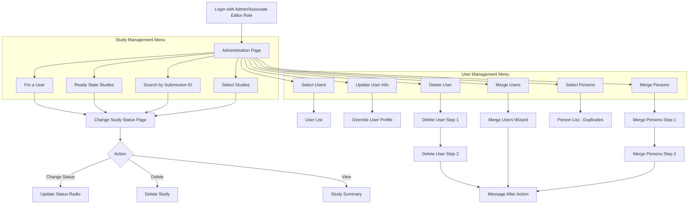

# User Story 5: Administration

## Overview

**As an** administrator,  
**I want to** administer studies and users,  
**So that** I can ensure efficient processing of phylogenetic data submissions.

## User Types

- System administrators
- TreeBASE curators with admin privileges (Admin role)

## Prerequisites

- User must be logged in with Admin role
- Access is controlled via Spring Security configuration in `treebase-security.xml`

## Current Pages

The following pages are involved in the administration workflow:

- [x] Admin landing page (`administrationPage.jsp`) - Main dashboard with links to Study Management and User Management menus
- [x] Study management for a user (`simpleUserManagement.jsp`) - List studies by submitter with filters
- [x] Management of ready studies (`changeStudyStatus.jsp`) - View and change status of Ready state studies
- [x] Search submissions (`searchBySubmissionID.jsp`) - Search by TreeBASE2, TB1 legacy, or TB2 Study ID
- [x] Select studies (`selectStudies.jsp`) - Select studies by status type
- [x] Select users (`adminSelectUsers.jsp`) - Search users by email, username, last name, or role
- [x] Update user info (`adminUpdatingUserInfo.jsp`) - Enter username to update
- [x] Override user profile (`overrideUserProfile.jsp`) - Modify user details after lookup
- [x] Delete user Step 1 (`adminDeletingUserStepOne.jsp`) - Enter username to delete
- [x] Delete user Step 2 (`adminDeletingUserStepTwo.jsp`) - Confirm deletion
- [x] Merge users (`adminMergingUsers.jsp`) - Merge source user into target user
- [x] Select persons (`adminSelectPersons.jsp`) - Find potential duplicate person records
- [x] Merge persons (`adminMergingPersons.jsp`) - Merge person records (affects user accounts and citations)
- [x] Merge persons Step 2 (`adminMergingPersonsStepTwo.jsp`) - Confirm person merge

## Navigation Flow

## Administration Functions

### Study Management

#### For a User (`/admin/userManagement.html`)
List all studies submitted by a particular user.

| Field | Type | Options/Values |
|-------|------|----------------|
| Search by | Radio | Email Address, Username (default), Last Name |
| User info | Text | Search term matching selected criteria |
| Study type | Dropdown | All, In Progress, Ready (default), Published |

#### Ready State Studies (`/admin/readyStateStudies.html`)
Shows all studies currently in "Ready" state for curation review.

#### Search by Submission ID (`/admin/searchBySubmissionID.html`)
Search for submissions using various identifier types.

| Field | Type | Options/Values |
|-------|------|----------------|
| Identifier Type | Radio | TreeBASE2 Submission ID (default), TreeBASE1 Legacy Study ID, TreeBase2 Study ID |
| Submission Accession | Text | The ID value to search (max 25 chars) |

#### Select Studies (`/admin/selectStudies.html`)
Filter studies by their status.

| Field | Type | Options/Values |
|-------|------|----------------|
| Study type | Dropdown | All, In Progress, Ready (default), Published |

#### Change Study Status (`/admin/changeStudyStatus.html`)
View and modify study statuses. Displayed as a table with columns:
- ID (link to study summary)
- Submitter (email link)
- Study Name
- Study Notes
- Created Date
- Last Modified Date
- Change Status (radio buttons: In Progress, Ready, Published)
- Delete link

### User Management

#### Select Users (`/admin/adminSelectUsers.html`)
Search for users based on various criteria.

| Field | Type | Options/Values |
|-------|------|----------------|
| Search by | Radio | Email Address, Username (default), Last Name, User Role |
| User info | Text | Search term (for Email/Username/Last Name) |
| User Role | Dropdown | (Available roles from system, e.g., Admin, User, Associate Editor) |

#### Update User Info (`/admin/adminUpdatingUserInfo.html`)
Enter a username to look up and modify.

| Field | Type | Description |
|-------|------|-------------|
| Username | Text | Username of the account to update |

Redirects to Override User Profile page on success.

#### Delete User (`/admin/adminDeletingUserStepOne.html` → `adminDeletingUserStepTwo.html`)
Two-step process to delete a user account.

**Step 1:**
| Field | Type | Description |
|-------|------|-------------|
| Username | Text | Username of the account to delete |

**Step 2:** Confirmation page before deletion.

#### Merge Users (`/admin/adminMergingUsers.html`)
Combine two user accounts into one.

| Field | Type | Description |
|-------|------|-------------|
| Source Username | Text | User account to be merged (will be removed) |
| Target Username | Text | User account to receive merged data |

#### Select Persons (`/admin/adminSelectPersons.html`)
Audit tool to find potential duplicate person records.

| Field | Type | Options/Values |
|-------|------|----------------|
| Search criteria | Radio | With Same First and Last Name (default), With Same Last Name |

#### Merge Persons (`/admin/adminMergingPersons.html` → `adminMergingPersonsStepTwo.html`)
Merge duplicate person records. This affects:
- User accounts associated with the person records
- Citation author/editor records

**Step 1:**
| Field | Type | Description |
|-------|------|-------------|
| Source Person ID | Text | ID of person record to be merged (will be deleted) |
| Target Person ID | Text | ID of person record to receive merged data |

**Step 2:** Confirmation page showing what will be affected.

## Pages to Account For

| Page | URL Pattern | JSP File | Status |
|------|-------------|----------|--------|
| Administration Landing | `/admin/administrationPage.html` | `administrationPage.jsp` | ✅ Implemented |
| User Management (Studies) | `/admin/userManagement.html` | `simpleUserManagement.jsp` | ✅ Implemented |
| Ready State Studies | `/admin/readyStateStudies.html` | `changeStudyStatus.jsp` | ✅ Implemented |
| Search by Submission ID | `/admin/searchBySubmissionID.html` | `searchBySubmissionID.jsp` | ✅ Implemented |
| Select Studies | `/admin/selectStudies.html` | `selectStudies.jsp` | ✅ Implemented |
| Change Study Status | `/admin/changeStudyStatus.html` | `changeStudyStatus.jsp` | ✅ Implemented |
| Select Users | `/admin/adminSelectUsers.html` | `adminSelectUsers.jsp` | ✅ Implemented |
| User List | `/admin/userList.html` | `userList.jsp` | ✅ Implemented |
| Update User Info | `/admin/adminUpdatingUserInfo.html` | `adminUpdatingUserInfo.jsp` | ✅ Implemented |
| Override User Profile | `/admin/overrideUserProfile.html` | `overrideUserProfile.jsp` | ✅ Implemented |
| Delete User Step 1 | `/admin/adminDeletingUserStepOne.html` | `adminDeletingUserStepOne.jsp` | ✅ Implemented |
| Delete User Step 2 | `/admin/adminDeletingUserStepTwo.html` | `adminDeletingUserStepTwo.jsp` | ✅ Implemented |
| Merge Users | `/admin/adminMergingUsers.html` | `adminMergingUsers.jsp` | ✅ Implemented |
| Select Persons | `/admin/adminSelectPersons.html` | `adminSelectPersons.jsp` | ✅ Implemented |
| Person List | `/admin/personList.html` | `personList.jsp` | ✅ Implemented |
| Merge Persons | `/admin/adminMergingPersons.html` | `adminMergingPersons.jsp` | ✅ Implemented |
| Merge Persons Step 2 | `/admin/adminMergingPersons.html` | `adminMergingPersonsStepTwo.jsp` | ✅ Implemented |
| Message After Action | `/admin/messageToAdminAfterAction.html` | `messageToAdminAfterAction.jsp` | ✅ Implemented |

## Technical Implementation Notes

### Access Control
- Admin pages are protected by Spring Security (`treebase-security.xml`)
- URL pattern `/admin/**` requires `Admin` or `Associate Editor` role
- Menu visibility controlled via `menu-config.xml` with `roles="Admin,Associate Editor"`

### Key Configuration Files
- `menu-config.xml` - Defines Study Management and User Management menus
- `treebase-servlet.xml` - URL to controller mappings (lines 1020-1037)
- `treebase-security.xml` - Security intercept rules

### Controllers
- `userManagementController` - For a User page
- `selectStudiesController` - Select Studies page
- `changeStudyStatusController` - Ready State and Change Status pages
- `searchBySubmissionIDController` - Search by Submission ID
- `adminSelectUsersController` - Select Users
- `adminUpdatingUserInfoController` - Update User Info
- `adminOverridingUserFormController` - Override User Profile
- `adminDeletingUserStepOneController` / `adminDeletingUserStepTwoController` - Delete User
- `adminMergingUsersController` - Merge Users
- `adminSelectPersonsController` - Select Persons
- `adminMergingPersonsController` - Merge Persons

## Wireframe Notes

*To be completed in future PR*

## Open Questions

- What admin roles/permission levels are needed beyond Admin and Associate Editor?
- What metrics should be tracked on the dashboard?
- How should escalation workflows work for stuck submissions?
- What audit logging requirements exist for admin actions?
- Should there be bulk operations for study status changes?
