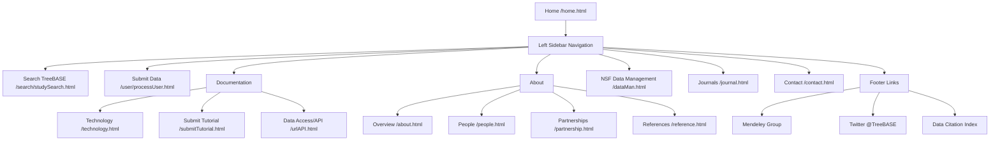

# User Story 7: Governance

## Overview

**As a** governance stakeholder,  
**I want to** learn about the project, its history, contributors, and role in phylogenetic data
management,  
**So that** I can understand TreeBASE's position in the scientific data ecosystem and make
informed decisions about its future.

## User Types

- Funding agency representatives
- Institutional administrators
- Scientific advisory board members
- Policy makers
- Potential partners and collaborators
- Science journalists and communicators

## Current Pages

The following pages in the current TreeBASE web application relate to this user story:

- [x] About page (`/about.html`) - Background information, history, funding, governance, and related resources
- [ ] History/timeline page - *Not a separate page; history content is included in the About page*
- [x] Contributors/team page (`/people.html`) - Current and past contributors with photos and roles
- [x] Mission statement - *Included in About page and Home page*
- [x] Data usage policies (`/dataMan.html`) - NSF Data Management Plan covering submission, integrity, standards, and persistence
- [ ] Terms of service - *Not currently available as a dedicated page*
- [ ] Privacy policy - *Not currently available as a dedicated page*
- [x] Contact information (`/contact.html`) - Help desk email and bug reporting via GitHub issues
- [ ] Governance structure - *Basic information included in About page; no dedicated governance page*
- [x] Funding acknowledgments - *Included in About page with NSF grant numbers*
- [x] Partnerships page (`/partnership.html`) - Current and historical institutional partners
- [x] References/Citations page (`/reference.html`) - How to cite TreeBASE publications
- [x] Technology page (`/technology.html`) - Implementation details and source code information
- [x] Journals page (`/journal.html`) - Partner journals and publication policies

## Navigation Flow

Users navigate to governance-related pages primarily through the left sidebar menu available on the home page and all main pages. The current navigation structure is:

**External Links in Footer:**
- Mendeley group for TreeBASE publications
- Twitter @TreeBASE
- Data Citation Index badge

## Governance Information

### About TreeBASE

**Coverage:** `/about.html` and `/home.html`

- What is TreeBASE - ✅ Covered in About page ("Background" section) and Home page welcome text
- Mission statement - ✅ Covered in About page and Home page (TreeBASE is a repository of phylogenetic information)
- Vision for the future - ⚠️ Partially covered; About page mentions current version but no explicit future vision
- Value proposition - ✅ Covered in About page (applications list) and Home page (new features list)

### History

**Coverage:** `/about.html` ("History, Funding, and Governance" section)

- Timeline of development - ✅ Covered (prototype 1994, redevelopment with CIPRES, v2.0 March 2010)
- Major milestones - ✅ Covered (NSF grants, institutional hosts over time)
- Evolution of the platform - ✅ Covered (mentions previous hosts: NESCent, Yale Peabody, SDSC, UB, Harvard, Leiden, UC Davis)
- Historical context in phylogenetics - ✅ Covered (references to Sanderson et al., Piel et al. publications)

### Team and Contributors

**Coverage:** `/people.html`

- Current team members - ✅ Covered with photos, names, and roles
- Advisory board - ❌ Not explicitly listed
- Past contributors - ✅ Covered ("Past developers" section)
- Institutional affiliations - ✅ Covered (institutions shown with contributor entries)

### Governance Structure

**Coverage:** `/about.html`, `/partnership.html`, `/journal.html`

- Decision-making processes - ⚠️ Partially covered; mentions Phyloinformatics Research Foundation governance
- Organizational structure - ✅ Covered in About page (Phyloinformatics Research Foundation, Inc.)
- Partner institutions - ✅ Covered in Partnerships page (Naturalis, NESCent, CIPRES, Dryad)
- Community involvement - ⚠️ Limited coverage; GitHub issues for bug reports mentioned in Contact
- Relationship with journals - ✅ Covered in Journals page (`/journal.html`) - lists partner journals that recommend/require TreeBASE submission, provides PhyloWS URLs for each journal's studies

### Policies

**Coverage:** `/dataMan.html`, `/submitTutorial.html`

- Data submission policies - ✅ Covered in NSF Data Management page and Submit Tutorial
- Data usage and licensing - ✅ Covered in NSF Data Management page (public domain, no restrictions on reuse)
- Terms of service - ❌ No dedicated page
- Privacy policy - ❌ No dedicated page
- Code of conduct - ❌ No dedicated page

### Impact and Metrics

**Coverage:** `/home.html`, `/reference.html`

- Usage statistics - ⚠️ Partially covered; Home page shows counts (4,076 publications, 8,777 authors, etc. as of April 2014 - needs update)
- Citation information - ✅ Covered in References page (how to cite TreeBASE)
- Data holdings summary - ✅ Covered in Home page (matrices, trees, taxon labels counts)
- Community reach - ⚠️ Limited; Twitter and Mendeley links in sidebar, Data Citation Index badge

### Funding and Support

**Coverage:** `/about.html`, `/partnership.html`

- Current funders - ⚠️ Limited; current host (Naturalis) mentioned but no current funding details
- Historical funding - ✅ Covered in About page (NSF grants DEB 9318325, EF 0331654)
- How to support TreeBASE - ❌ Not covered
- Institutional partnerships - ✅ Covered in Partnerships page

### Contact and Engagement

**Coverage:** `/contact.html`, sidebar links, GitHub

- Contact information - ✅ Covered in Contact page (help@treebase.org)
- Social media presence - ✅ Twitter link in sidebar
- Community forums - ✅ Available via GitHub:
  - Issues/bugs: https://github.com/TreeBASE/treebase/issues
  - Discussions: https://github.com/TreeBASE/treebase/discussions

## Pages to Account For

The following is a complete inventory of pages related to governance:

| Page | URL Pattern | Status | Notes |
|------|-------------|--------|-------|
| Home | `/home.html` | ✅ Exists | Welcome message, mission overview, recent studies |
| About/Overview | `/about.html` | ✅ Exists | Background, history, funding, governance, related resources |
| People/Team | `/people.html` | ✅ Exists | Current and past contributors with photos |
| Partnerships | `/partnership.html` | ✅ Exists | Institutional partners (Naturalis, NESCent, CIPRES, Dryad) |
| References | `/reference.html` | ✅ Exists | How to cite TreeBASE |
| Technology | `/technology.html` | ✅ Exists | Implementation stack, source code links |
| Submit Tutorial | `/submitTutorial.html` | ✅ Exists | Submission process documentation |
| Data Access/API | `/urlAPI.html` | ✅ Exists | Web service and programmatic access |
| NSF Data Management | `/dataMan.html` | ✅ Exists | Data management plan details |
| Journals | `/journal.html` | ✅ Exists | Partner journals requiring TreeBASE submissions |
| Contact | `/contact.html` | ✅ Exists | Help desk email, GitHub issue tracker |
| Terms of Service | N/A | ❌ Missing | No dedicated page |
| Privacy Policy | N/A | ❌ Missing | No dedicated page |
| Governance Structure | N/A | ❌ Missing | Basic info in About page only |
| Usage Statistics | N/A | ❌ Missing | Some stats on home page, no dedicated page |
| Impact Metrics | N/A | ❌ Missing | No dedicated page |

## Wireframe Notes

*To be completed in future PR*

## Open Questions

- What governance information should be prominently featured?
- How should historical information be presented?
- What metrics should be publicly displayed?
- How should contact/support requests be handled?
